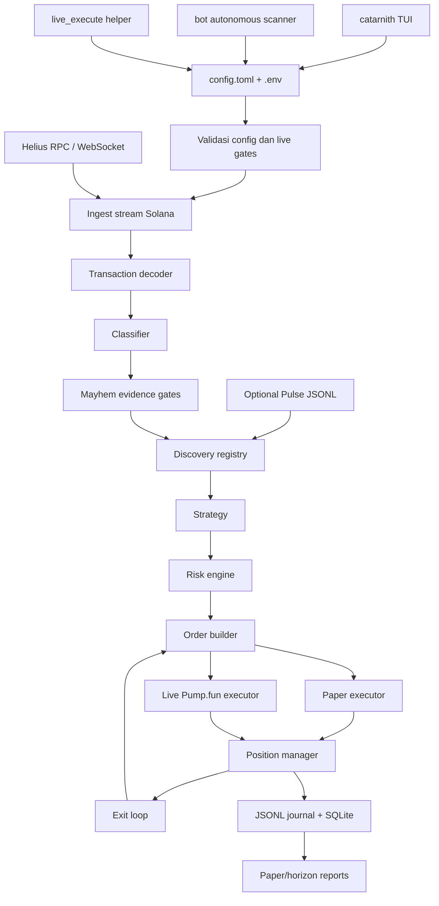
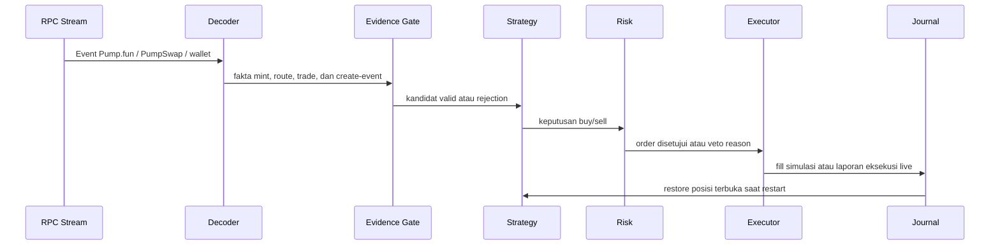

# Dokumentasi Catarnith

Catarnith adalah aplikasi trading Solana berbasis terminal untuk pasar bergaya
Pump.fun. Project ini menggabungkan TUI interaktif, scanner otonom yang
paper-first, dan jalur eksekusi live yang dikunci oleh guardrail lewat satu file
konfigurasi lokal: `config.toml`.

Catarnith tidak membuat atau meluncurkan token. Aplikasi ini mengamati aktivitas
on-chain, memfilter kandidat mint baru, mengevaluasi risiko, lalu mensimulasikan
trade di paper mode atau mengirim transaksi Pump.fun sungguhan hanya ketika live
mode sudah diaktifkan secara eksplisit.

## Ringkasan Project

Catarnith dibuat untuk operator yang membutuhkan feedback cepat, guardrail yang
tegas, dan konfigurasi lokal yang mudah diulang.

| Area | Deskripsi |
| --- | --- |
| Terminal utama | `catarnith` membuka mode picker, settings editor, paper trade, live trade, dan panic-sell flow. |
| Bot otonom | `bot` menjalankan loop scanner/trader multi-mint dengan `config.toml`. |
| Helper live | `live_execute` menjalankan buy/sell satu kali dan dipakai oleh panic-sell path. |
| Safety default | Paper mode adalah default. Live trading tetap terkunci sampai semua validasi config dan wallet lolos. |
| Output | Journal runtime dan state SQLite ditulis ke `journals/` secara default. |

## Mode Runtime

```text
[1] Auto Bot     loop scanner/trader otonom
[2] Live Trade   trade live satu per satu dengan SOL sungguhan, jika sudah armed
[3] Paper Trade  trading simulasi, tanpa order sungguhan
[S] Settings     wallet, key, buy size, risk, dan runtime knobs
```

Memilih Live di TUI tidak melewati safety check. Config tetap harus diaktifkan
dengan sengaja.

## Cara Menggunakan TUI

Jalankan binary yang sudah di-install dengan:

```bash
catarnith
```

Jika hanya build lokal tanpa install:

```bash
./target/release/catarnith
```

Footer di bagian bawah TUI selalu menampilkan tombol yang valid untuk screen
yang sedang aktif.

### First Run

Jika Catarnith tidak menemukan `config.toml` atau `.env`, aplikasi akan membuka
Settings terlebih dahulu. Isi field wajib, tekan `Enter` untuk menyimpan, lalu
kembali ke mode picker. Save akan menulis `config.toml` dan key yang sesuai di
`.env`.

### Tombol Global

| Tombol | Aksi |
| --- | --- |
| `T` | Ganti theme terminal. |
| `L` | Tampilkan/sembunyikan panel log. |
| `Q` | Quit dari screen non-settings. |
| `Ctrl-C` | Quit dari screen apa pun. |
| `Esc` | Back, cancel, atau kembali ke menu sesuai screen. |

Shortcut huruf global dimatikan saat mengetik di Settings supaya value seperti
wallet key dan RPC URL bisa diisi normal.

### Mode Picker

| Tombol | Aksi |
| --- | --- |
| `1` | Buka Auto Bot setup. |
| `2` | Masuk Live Trade mode. |
| `3` | Masuk Paper Trade mode. |
| `S` | Buka Settings. |
| `T` | Ganti theme. |
| `Q` | Quit. |

Mode picker juga menampilkan path config aktif, biasanya `config.toml`.

### Settings

Settings adalah editor utama untuk operator. Screen ini mengatur wallet, key,
buy size, dan risk control.

| Tombol | Aksi |
| --- | --- |
| `Tab` / `Down` | Pindah ke field berikutnya. |
| `Shift-Tab` / `Up` | Pindah ke field sebelumnya. |
| `Left` / `Right` | Mengubah pilihan seperti theme, mode, pair scope, atau advanced toggle. |
| Ketik teks | Mengedit text field yang aktif. |
| `Backspace` | Menghapus satu karakter dari text field aktif. |
| `Enter` | Menyimpan Settings. |
| `Esc` | Kembali ke mode picker tanpa memulai trade. |

Field yang bisa diedit:

- Private key/base58 wallet
- Buy size dalam SOL
- Helius API key
- Fallback RPC URL
- Jupiter API key
- Slippage dalam bps
- Max hold seconds
- Theme
- Mode: Paper atau Live
- Pair scope: Mayhem-only atau semua Pump.fun
- Advanced risk: take-profit, stop-loss, max open positions, daily loss limit

Menyimpan Settings tidak otomatis mengaktifkan live trading. Live tetap harus
mengikuti checklist live mode di bagian bawah dokumen ini.

### Auto Bot Setup

Tekan `1` dari mode picker untuk mengatur autonomous scanner sebelum mulai.
Kontrolnya sama seperti Settings, tetapi `Enter` akan save dan langsung
menjalankan bot.

Auto Bot setup mencakup:

- Mode
- Pair scope
- Buy size
- Slippage
- Max hold
- Batas umur stream event
- Buy deadline
- Advanced options: create slot lag, backfill, full transaction fetch, curve
  exit quotes, confirmation polling, fallback read behavior

Saat bot berjalan:

| Tombol | Aksi |
| --- | --- |
| `Esc` | Stop bot. |
| `Q` | Quit. |
| `L` | Tampilkan/sembunyikan log. |

Setelah bot berhenti, tekan `Esc` lagi untuk kembali ke menu.

### Screen Paper Trade dan Live Trade

Paper Trade dan Live Trade memakai flow visual yang sama:

```text
Welcome -> Scanning -> Evaluating -> Holding -> Selling -> Result
```

| Screen | Aksi Utama |
| --- | --- |
| Welcome | Tekan tombol apa saja untuk mulai scanning. |
| Scanning | Catarnith mendengarkan event kandidat baru. |
| Evaluating | Kandidat dicek lewat evidence, strategy, dan risk. |
| Holding | Tekan `Enter` untuk sell posisi yang sedang di-hold. |
| Selling | Tunggu fill paper atau hasil live sell. |
| Result | Tekan `Enter` untuk trade lagi atau `Esc` untuk kembali ke menu. |

Jika ada posisi terbuka dan kamu menekan `Esc`, Catarnith akan meminta
konfirmasi. Jika kamu keluar, posisi tetap terbuka; posisi tidak otomatis
dijual hanya karena kamu meninggalkan screen.

### Logs

Tekan `L` di screen non-settings untuk menampilkan atau menyembunyikan panel
log. Pesan terbaru berada dekat bagian bawah. Line eksekusi, sell, panic, dan
error akan di-highlight supaya isu operasional lebih mudah terlihat.

### Panic Sell

Untuk panic-sell langsung dari shell:

```bash
catarnith panic-sell <MINT> --config config.toml
```

Command ini diteruskan ke live execution helper dengan panic path aktif. Tetap
memakai wallet, RPC, slippage, dan live safety setting dari config.

## Arsitektur



## Flow Trading



## Model Keamanan

Paper mode tidak pernah mengirim order. Mode ini hanya mencatat fill simulasi
dan PnL ke journal lokal.

Live mode menolak broadcast kecuali:

- `mode = "live"`
- `enable_live_trading = true`
- `require_manual_live_unlock = false`
- dedicated hot-wallet sudah dikonfigurasi
- file wallet berada di luar repository dan owner-only
- path wallet tidak terlihat seperti main/cold/treasury wallet
- fallback RPC adalah provider paid yang berbeda ketika dibutuhkan
- risk cap ada dan cukup besar untuk buy size yang dipakai
- `[live].max_balance_lamports` membatasi saldo wallet maksimum yang boleh
  dipakai Catarnith

Project ini adalah otomasi untuk market yang berisiko. Anggap live mode sebagai
software uang sungguhan dan validasi perubahan di paper mode terlebih dahulu.

## Setup

### 1. Prasyarat

- Rust stable toolchain
- Helius API key
- Opsional tetapi direkomendasikan untuk live mode: Solana RPC paid yang berbeda
- Opsional untuk sell fallback: Jupiter API key
- Khusus live mode: dedicated hot wallet dengan saldo rendah

### 2. Buat File Config Lokal

```bash
cp config.example.toml config.toml
cp .env.example .env
```

`config.toml` dan `.env` sudah di-ignore oleh git.

### 3. Isi Nilai Wajib

Di `.env`:

```bash
export HELIUS_API_KEY=your-helius-api-key
export CTARNITH_FALLBACK_RPC_URL=https://your-paid-rpc.example
```

Di `config.toml`, mulai dari:

```toml
mode = "paper"
base_buy_lamports = 13025001
enable_live_trading = false
require_manual_live_unlock = true
```

Tetap gunakan paper mode sampai journal menunjukkan perilaku yang sudah kamu
percaya.

### 4. Build

```bash
cargo build --release --locked --features live-executor,tui --bins
```

Gunakan `--locked` supaya Cargo memakai versi dependency yang sudah dipin di
`Cargo.lock`.

## Referensi Konfigurasi

Catarnith memuat konfigurasi dengan urutan:

1. Default bawaan
2. File TOML terpilih, biasanya `config.toml`
3. Override dari `.env` dan environment process

Setup baru sebaiknya memakai env var `CTARNITH_*`. Alias lama `MAYHEM_*` masih
dibaca sebagai fallback.

### Config Utama

| Key | Deskripsi Singkat |
| --- | --- |
| `mode` | `"paper"` atau `"live"`. Paper adalah safe mode default. |
| `helius_api_key` | Helius API key. Biasanya diisi lewat `HELIUS_API_KEY` di `.env`. |
| `wallet_keypair_path` | Path ke file JSON keypair dedicated hot-wallet untuk live. |
| `wallet_keypair_base58` | Private key base58 opsional. Untuk secret, lebih baik lewat `.env`. |
| `pair_scope` | `"mayhem_only"` untuk filter ketat atau `"all_pumpfun"` untuk observasi lebih luas. |
| `base_buy_lamports` | Buy size dalam lamports. `1 SOL = 1_000_000_000` lamports. |
| `journal_dir` | Direktori untuk journal JSONL runtime. |
| `sqlite_path` | Path SQLite untuk restore posisi. |

### Discovery dan Evidence

| Key | Deskripsi Singkat |
| --- | --- |
| `require_mayhem_evidence` | Wajib ada evidence Mayhem terpercaya sebelum entry. |
| `allow_indirect_mayhem_candidates` | Mengizinkan kandidat indirect yang lebih lemah jika aktif. |
| `require_route_confirmation` | Wajib route confirmation seperti Axiom -> Pump.fun/PumpSwap. |
| `follow_observed_sell_signals` | Observed sell activity boleh memengaruhi exit. |
| `mayhem_mint_allowlist_path` | Allowlist mint terverifikasi, satu mint per baris. |
| `mayhem_metadata_url_template` | Template endpoint metadata terpercaya. |
| `pulse_mints_path` | Feed discovery JSONL opsional yang di-tail saat runtime. |
| `allow_onchain_mayhem_discovery` | Mengizinkan evidence Mayhem on-chain untuk verifikasi discovery. |
| `require_fresh_mint_creation` | Wajib evidence mint baru berbasis create event. Direkomendasikan untuk live speed mode. |
| `max_stream_event_age_ms` | Menolak event stream yang sudah stale. |
| `entry_deadline_ms` | Umur lokal maksimum sebelum buy dianggap terlambat. |
| `max_create_event_slot_lag` | Menolak create event yang terlalu jauh di belakang processed slot terbaru. |

### Risk dan Exit

| Key | Deskripsi Singkat |
| --- | --- |
| `max_open_positions` | Jumlah posisi terbuka maksimum. |
| `max_buys_per_mint` | Jumlah buy maksimum untuk satu mint. |
| `max_total_lamports_per_mint` | Cap exposure per mint. |
| `max_total_open_lamports` | Cap total exposure terbuka. |
| `max_daily_loss_lamports` | Rolling loss cap sebelum buy baru diveto. |
| `max_failed_txs_per_minute` | Cap safety untuk failure rate. |
| `max_failed_fee_burn_lamports_per_hour` | Cap safety untuk fee burn. |
| `max_slippage_bps` | Batas slippage buy dalam basis points. |
| `paper_slippage_bps` | Model slippage adverse untuk fill paper. |
| `paper_fee_lamports_floor` | Fee minimum untuk fill simulasi. |
| `take_profit_bps` | Trigger take-profit. |
| `take_profit_sell_bps` | Porsi yang dijual setelah take-profit, dalam basis points. |
| `stop_loss_bps` | Trigger stop-loss. |
| `max_hold_seconds` | Timer forced exit. |
| `enable_take_profit_exit` | Mengaktifkan exit take-profit. |
| `enable_stop_loss_exit` | Mengaktifkan exit stop-loss. |
| `enable_curve_exit_quotes` | Memakai curve quote untuk valuasi exit. |

### Runtime Stream

| Key | Deskripsi Singkat |
| --- | --- |
| `subscribe_commitment` | Commitment stream, biasanya `"processed"`. |
| `subscribe_programs` | Subscribe ke log program yang dikonfigurasi. |
| `enable_transaction_subscribe` | Mengaktifkan transactionSubscribe jika plan RPC mendukung. |
| `enable_logs_fallback` | Fallback ke logsSubscribe jika transactionSubscribe tidak tersedia. |
| `fetch_full_transaction` | Fetch full transaction untuk decoding yang lebih kaya. |
| `use_observed_entry_fill` | Model paper-only yang menilai entry dari transaksi sinyal. |
| `backfill_limit` | Kedalaman backfill startup. Simpan `0` untuk live mode. |

### Live Execution

Table `[live]` mengatur pengiriman transaksi sungguhan.

| Key `[live]` | Env Override | Deskripsi Singkat |
| --- | --- | --- |
| `compute_unit_limit` | `CTARNITH_LIVE_COMPUTE_UNIT_LIMIT` | Compute unit per transaksi trade. |
| `compute_unit_price_microlamports` | `CTARNITH_LIVE_COMPUTE_UNIT_PRICE_MICROLAMPORTS` | Priority fee. |
| `send_max_retries` | `CTARNITH_LIVE_SEND_MAX_RETRIES` | Retry pengiriman RPC. |
| `send_timeout_ms` | `CTARNITH_LIVE_SEND_TIMEOUT_MS` | Timeout per RPC send. |
| `rpc_timeout_ms` | `CTARNITH_LIVE_RPC_TIMEOUT_MS` | Timeout request RPC umum. |
| `confirmation_timeout_ms` | `CTARNITH_LIVE_CONFIRMATION_TIMEOUT_MS` | Timeout konfirmasi buy. |
| `sell_confirmation_timeout_ms` | `CTARNITH_LIVE_SELL_CONFIRMATION_TIMEOUT_MS` | Timeout konfirmasi sell. |
| `confirmation_poll_ms` | `CTARNITH_LIVE_CONFIRMATION_POLL_MS` | Interval polling konfirmasi. |
| `pre_broadcast_simulation` | `CTARNITH_LIVE_PRE_BROADCAST_SIMULATION` | Simulasi sebelum broadcast jika aktif. |
| `settlement_commitment` | `CTARNITH_LIVE_SETTLEMENT_COMMITMENT` | `processed`, `confirmed`, atau `finalized`. |
| `sell_slippage_bps` | `CTARNITH_LIVE_SELL_SLIPPAGE_BPS` | Slippage sell; kosongkan untuk memakai `max_slippage_bps`. |
| `max_balance_lamports` | `CTARNITH_LIVE_MAX_BALANCE_LAMPORTS` | Menolak trade jika saldo wallet di atas nilai ini. |
| `jito_block_engine_url` | `CTARNITH_LIVE_JITO_BLOCK_ENGINE_URL` | Path Jito opsional untuk panic-sell. |
| `jito_tip_account` | `CTARNITH_LIVE_JITO_TIP_ACCOUNT` | Akun tip Jito. |
| `jito_tip_lamports` | `CTARNITH_LIVE_JITO_TIP_LAMPORTS` | Jumlah tip Jito. |
| `jupiter_timeout_ms` | `CTARNITH_LIVE_JUPITER_TIMEOUT_MS` | Timeout untuk Jupiter sell fallback. |

## Environment Variables Penting

| Variable | Deskripsi |
| --- | --- |
| `HELIUS_API_KEY` | Helius API key utama. Dipakai untuk membuat URL RPC/WebSocket utama. |
| `HELIUS_API_KEY_FILE` | Path opsional ke file yang berisi Helius API key. |
| `CTARNITH_LIVE_CONFIG` | Override path config aktif. Default `config.toml`. |
| `CTARNITH_FALLBACK_RPC_URL` | Solana RPC paid berbeda untuk live broadcast/fallback. |
| `JUP_API_KEY` | Jupiter API key opsional untuk sell fallback terakhir. |
| `CTARNITH_WALLET_KEYPAIR_PATH` | Path file keypair hot-wallet live. |
| `CTARNITH_WALLET_KEYPAIR_BASE58` | Private key base58 hot-wallet live. Menang atas keypair path. |
| `CTARNITH_LIVE_BASE_BUY_LAMPORTS` | Override env untuk buy size. |
| `CTARNITH_LIVE_MAX_SLIPPAGE_BPS` | Override env untuk slippage buy. |
| `CTARNITH_PAIR_SCOPE` | Override env untuk `pair_scope`. |
| `CTARNITH_LIVE_SELL_SLIPPAGE_BPS` | Override slippage khusus sell. |
| `CTARNITH_LIVE_MAX_HOLD_SECONDS` | Override timer forced exit. |
| `CTARNITH_LIVE_PARALLEL_FALLBACK_READS` | Membaca dari primary dan fallback RPC secara paralel jika aktif. |
| `CTARNITH_LIVE_WAIT_FOR_BUY_CONFIRMATION` | Jika true, menunggu konfirmasi buy sebelum lanjut. |
| `CTARNITH_LIVE_SKIP_POST_TRADE_BALANCES` | Jika true, melewati baca balance setelah trade. |
| `CTARNITH_SCAN_SOL_PRICE_USD` | Mengunci harga SOL/USD di scan UI dan melewati fetch harga saat startup. |
| `CTARNITH_SCAN_SKIP_PICKER` | Melewati mode picker dan langsung masuk scan mode. |
| `CTARNITH_LIVE_PANIC_SEND_TIMEOUT_MS` | Timeout send untuk panic-sell. |
| `CTARNITH_LIVE_PANIC_BALANCE_TIMEOUT_MS` | Timeout baca balance untuk panic-sell. |

## Cara Menjalankan

### Terminal Interaktif

```bash
cargo run --features live-executor,tui --bin catarnith
```

### Lewati Picker dan Masuk Trade Screen

```bash
cargo run --features live-executor,tui --bin catarnith -- scan
```

### Bot Otonom

```bash
cargo run --features live-executor --bin bot -- --config config.toml
```

### One-Shot Live Execute

```bash
cargo run --features live-executor --bin live_execute -- \
  --config config.toml --side sell --mint <MINT>
```

### Panic Sell Lewat Catarnith

```bash
cargo run --features live-executor,tui --bin catarnith -- \
  panic-sell <MINT> --config config.toml
```

### Build Binary Release

```bash
cargo build --release --locked --features live-executor,tui --bins
```

Lalu jalankan:

```bash
./target/release/catarnith
./target/release/bot --config config.toml
./target/release/live_execute --config config.toml --side sell --mint <MINT>
```

### Test

```bash
cargo test --features "live-executor tui"
```

## Checklist Live Mode

Sebelum live mode:

1. Jalankan paper mode cukup lama sampai perilaku journal bisa dipercaya.
2. Set `mode = "live"`.
3. Set `enable_live_trading = true`.
4. Set `require_manual_live_unlock = false`.
5. Pakai dedicated hot wallet, bukan main atau treasury wallet.
6. Simpan file wallet di luar repository dan jalankan `chmod 600 <wallet-file>`.
7. Set `CTARNITH_FALLBACK_RPC_URL` ke paid RPC yang berbeda.
8. Jaga `[live].max_balance_lamports` tetap rendah.
9. Simpan `backfill_limit = 0`.
10. Jalankan ulang test setelah perubahan config atau code.

## Output Runtime

Secara default, Catarnith menulis output runtime lokal ke:

```text
journals/bot/
```

File penting:

| File | Deskripsi |
| --- | --- |
| `raw_events.jsonl` | Event mentah dari stream. |
| `decisions.jsonl` | Keputusan strategy dan risk veto. |
| `orders.jsonl` | Order yang dibuat dari keputusan approved. |
| `executions.jsonl` | Laporan eksekusi paper atau live. |
| `positions.jsonl` | Snapshot posisi. |
| `metrics_snapshots.jsonl` | Metrik heartbeat runtime. |
| SQLite file | State untuk restore posisi setelah restart. |

## Troubleshooting

| Gejala | Yang Perlu Dicek |
| --- | --- |
| Config tidak bisa dimuat | Pastikan `config.toml` ada dan valid sebagai TOML. |
| Helius key hilang | Set `HELIUS_API_KEY`, `HELIUS_API_KEY_FILE`, atau `helius_api_key`. |
| Live mode menolak start | Cek arming flag, path wallet, fallback RPC, dan risk cap. |
| Kandidat tidak muncul | Cek akses RPC/WebSocket, stream fallback, dan evidence gates. |
| Decision ditolak | Lihat `decisions.jsonl` untuk `risk_veto_reason`. |
| Order dibuat tapi tidak ada fill | Cek `executions.jsonl`, slippage, error RPC, dan saldo wallet. |
| Wallet balance diblokir | Turunkan saldo wallet atau naikkan `[live].max_balance_lamports` secara sengaja. |
