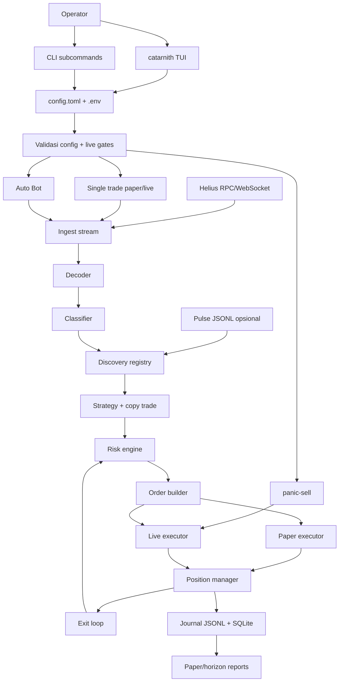
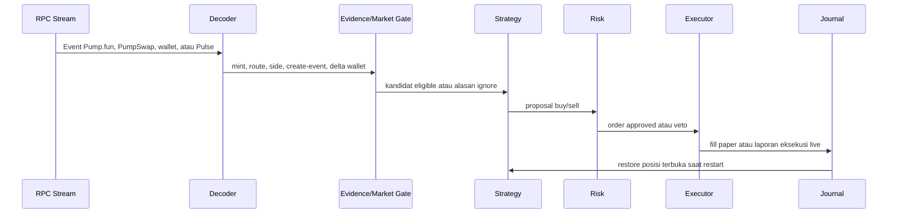

# Dokumentasi Catarnith

Catarnith adalah aplikasi trading Solana Pump.fun berbasis terminal. Project ini
menggabungkan TUI, paper trading, live execution yang dikunci guardrail, scanner
otonom, copy trade, dan panic-sell tooling dengan satu profil runtime lokal:
`config.toml`.

Catarnith tidak membuat atau meluncurkan token. Aplikasi ini hanya mengamati
market Pump.fun yang sudah ada, memfilter kandidat, menerapkan risk rule, lalu
mensimulasikan order di paper mode atau broadcast transaksi live setelah semua
live gate lolos.

## Deskripsi Project

| Area | Fungsi |
| --- | --- |
| `catarnith` | Aplikasi terminal utama dengan mode picker, Settings, paper trade, live trade, Auto Bot launcher, logs, dan panic-sell UI. |
| `bot` | Loop scanner/trader otonom. Bisa dipakai langsung atau lewat `[1] Auto Bot` di TUI. |
| `live_execute` | Helper live buy/sell satu kali untuk panic-sell dan workflow CLI advanced. |
| `config.toml` | Satu profil runtime lokal untuk paper, live, dan Auto Bot. |
| `.env` | Secret lokal dan override khusus mesin. |
| `journals/` | Journal JSONL, state SQLite posisi, report, dan evidence runtime. |

Paper mode adalah safe path default. Live mode tersedia, tetapi membutuhkan
dedicated wallet, flag arming live, risk cap, dan pemeriksaan safety wallet/RPC.

## Arsitektur



## Flow Trading



## Mode Runtime

Menjalankan `catarnith` membuka mode picker:

```text
[1] Auto Bot      loop scanner/trader otonom
[2] Live Trade    flow live trade satu posisi
[3] Paper Trade   paper trading, tanpa order real
[S] Settings      wallet, key, market, buy size, live setup
```

Mode picker adalah sumber kebenaran untuk single-trade mode. Memilih Paper
memaksa eksekusi paper-only untuk run itu. Memilih Live memaksa validasi live
dan baru memakai live executor jika live gate sudah di-arm.

## Cara Menggunakan TUI

### Tombol Global

| Tombol | Aksi |
| --- | --- |
| `1`, `2`, `3`, `S` | Pilih Auto Bot, Live Trade, Paper Trade, atau Settings dari mode picker. |
| `Enter` | Start, confirm, sell saat diminta, atau save setup screen aktif. |
| `Esc` | Back/cancel. Di screen bot/live, menutup log overlay dulu jika sedang terbuka. |
| `Q` | Quit dari screen yang bukan text-entry. |
| `T` | Ganti theme terminal. |
| `L` | Buka atau tutup log overlay besar. |
| `Up` / `Down` | Scroll log normal di luar settings screen. |
| `PgUp` / `PgDn` | Scroll log lebih cepat. |
| `Home` / `End` | Lompat ke log paling lama atau kembali ke tail. |
| `Tab` / `Shift+Tab` | Pindah field di Settings dan Auto Bot Setup. |
| `Left` / `Right` | Toggle/cycle pilihan seperti market, theme, live gate, copy sizing, atau copy policy. |

### Settings

Settings dipakai untuk setup level operator:

- secret wallet atau path keypair wallet
- Helius API key
- fallback RPC opsional
- Jupiter API key opsional
- market preference: `mayhem_only`, `non_mayhem_only`, atau `all_pumpfun`
- buy size, buy slippage, dan theme
- live advanced controls: live enable, live lock, max wallet balance, max hold,
  sell slippage, priority fee, Jito URL/tip, confirmation polling, dan
  pre-broadcast simulation

Settings tidak berisi picker paper/live. Paper vs Live dipilih dari mode picker
utama.

### Auto Bot Setup

Auto Bot Setup muncul sebelum `[1] Auto Bot` berjalan. Screen ini mengatur
konfigurasi khusus bot:

- default mode untuk direct bot: paper atau live
- market preference
- buy size, slippage, max hold, stream age, dan buy deadline
- copy trade wallet, sizing, max buy, dan follow-sells toggle
- advanced bot controls: keep-alive, max positions, max buys per mint,
  exposure per mint, total exposure terbuka, daily loss, copy buy policy,
  copy-specific caps, create slot lag, backfill, full transaction fetch, curve
  exit quotes, confirmation polling, dan fallback reads

Saat `bot_keep_alive = true`, TUI akan restart child process bot jika proses
keluar tidak terduga. Startup failure yang berulang cepat akan dihentikan dan
ditampilkan di logs.

### Screen Trade

Paper Trade dan Live Trade memakai lifecycle visual yang sama:

```text
Welcome -> Scanning -> Evaluating -> Holding -> Selling -> Result
```

| Screen | Yang Terjadi |
| --- | --- |
| Welcome | Tekan `Enter` untuk mulai scanning. |
| Scanning | Catarnith mendengarkan event kandidat baru. |
| Evaluating | Kandidat dicek terhadap market, discovery, strategy, dan risk rule. |
| Holding | Tekan `Enter` untuk sell posisi yang sedang di-hold. |
| Selling | Tunggu fill paper atau hasil live sell. |
| Result | Tekan `Enter` untuk trade lagi atau `Esc` untuk kembali ke picker. |

Jika ada posisi terbuka dan kamu menekan `Esc`, Catarnith meminta konfirmasi
sebelum meninggalkan trade screen.

Di live mode, `submitted` berarti transaksi sell sudah dibroadcast tetapi belum
terkonfirmasi. Catarnith tetap menampilkan posisi sebagai held sampai konfirmasi
atau rekonsiliasi membuktikan inventory sudah kosong.

### Logs

Tekan `L` untuk membuka log overlay besar. Log bisa discroll dengan `PgUp`,
`PgDn`, `Home`, dan `End`. Noise lifecycle yang normal dibersihkan, sementara
error eksekusi, transport, panic-sell, dan fatal bot tetap terlihat.

## Setup

### Prasyarat

- Rust stable toolchain
- Helius API key
- Untuk live trading: dedicated hot wallet dengan saldo rendah
- Opsional untuk reliabilitas live: fallback RPC paid yang berbeda
- Opsional untuk last-resort sell fallback: Jupiter API key terautentikasi

### Install Dari Source

```bash
git clone https://github.com/jxstme22/catarnith.git
cd catarnith
cargo install --path . --locked
catarnith
```

Untuk development tanpa install:

```bash
cargo run --bin catarnith
```

### Buat File Lokal

```bash
cp config.example.toml config.toml
cp .env.example .env
```

Kedua file ini di-gitignore. Jangan commit wallet key, RPC key, atau `.env`.

### Nilai Lokal Minimum

Di `.env`:

```bash
export HELIUS_API_KEY=your-helius-api-key
```

Di `config.toml`, pertahankan default aman sampai perilaku paper terlihat sehat:

```toml
mode = "paper"
market = "mayhem_only"
enable_live_trading = false
require_manual_live_unlock = true
```

## Config Penting

| Key | Makna |
| --- | --- |
| `mode` | Default untuk direct `bot`/`scan` run. Mode picker TUI menimpa mode single-trade. |
| `helius_api_key` | Helius API key, biasanya lewat `HELIUS_API_KEY`. |
| `wallet_keypair_path` | Path JSON dedicated hot-wallet live. |
| `wallet_keypair_base58` | Secret base58 opsional. Untuk secret, lebih aman di `.env`. |
| `market` | `mayhem_only`, `non_mayhem_only`, atau `all_pumpfun`. Legacy `pair_scope` masih dibaca. Ini menjadi gate untuk entry normal dan buy copy-trade. |
| `target_wallet` | Reference wallet opsional. Biarkan unset kecuali memang sengaja dipakai. |
| `watched_wallets` | Wallet tambahan opsional untuk diawasi. |
| `base_buy_sol` | Buy size dasar dalam SOL. Legacy `base_buy_lamports` masih dibaca. |
| `max_slippage_bps` | Batas slippage buy dalam basis points. |
| `max_hold_seconds` | Timer forced exit. |
| `max_open_positions` | Batas posisi terbuka bersamaan. |
| `max_buys_per_mint` | Batas total buy-attempt per mint. |
| `max_total_sol_per_mint` | Batas exposure per mint dalam SOL. |
| `max_total_open_sol` | Batas total exposure terbuka dalam SOL. |
| `max_daily_loss_sol` | Stop daily loss untuk entry baru dalam SOL. |
| `backfill_limit` | Kedalaman history startup. Simpan `0` untuk live. |
| `journal_dir` | Direktori journal JSONL. |
| `sqlite_path` | Path state posisi SQLite. |

### Market Selection

- `mayhem_only`: entry hanya saat evidence Mayhem diizinkan/terverifikasi.
  Scanner single-trade menunggu flag Mayhem positif dari curve Pump.fun.
- `non_mayhem_only`: hanya entry fresh create/create-v2 Pump.fun. Mode ini
  menolak evidence Mayhem langsung, kandidat Mayhem tidak langsung, dan buy
  copy-trade Mayhem. Scanner single-trade mensyaratkan curve mengembalikan
  `is_mayhem_mode = false`; jika flag belum tersedia, kandidat diskip.
- `all_pumpfun`: mengizinkan kandidat Pump.fun Mayhem dan non-Mayhem yang lolos
  filter lain.

## Copy Trade

Copy trade adalah bagian dari Auto Bot. Fitur ini mengikuti source wallet yang
dikonfigurasi, tetapi tetap memakai strategy, risk engine, executor, journal,
dan position manager milik Catarnith.

| Key | Makna |
| --- | --- |
| `copy_trade_enabled` | Mengaktifkan copy trade. |
| `copy_trade_wallet` | Source wallet yang diikuti. |
| `copy_trade_sizing` | `fixed`, `mirror`, atau `scaled`. |
| `copy_trade_scale_bps` | Faktor scale untuk `scaled`; `10000` berarti 1.0x. |
| `copy_trade_max_buy_sol` | Cap keras ukuran copied buy dalam SOL. |
| `copy_trade_buy_policy` | `first_only` atau `accumulate`. |
| `copy_trade_max_buys_per_mint` | Batas buy copy per mint. |
| `copy_trade_min_source_buy_sol` | Abaikan source buy di bawah nilai ini; `0` mematikan filter. |
| `copy_trade_follow_sells` | Sell ketika source wallet menjual mint yang sedang di-hold Catarnith. |
| `copy_trade_max_hold_seconds` | Timer forced exit untuk posisi hasil copy. |
| `copy_trade_take_profit_bps` | Trigger take-profit khusus copy; `0` mematikan. |
| `copy_trade_take_profit_sell_bps` | Porsi sell saat copy take-profit. |
| `copy_trade_stop_loss_bps` | Trigger stop-loss khusus copy; `0` mematikan. |
| `copy_trade_allow_pumpswap` | Khusus paper/research. Live PumpSwap copy execution diblokir. |

Atribusi copy ketat: transaksi copy harus berasal dari stream wallet yang
dicopy atau wallet itu menjadi signer. Transaksi yang hanya menyebut wallet
sebagai account key akan diabaikan.

Buy copy-trade mengikuti `market`. `non_mayhem_only` menolak sinyal Mayhem
langsung, tidak langsung, atau terverifikasi; `mayhem_only` membutuhkan
evidence Mayhem; `all_pumpfun` mengizinkan kedua sisi market Pump.fun.

## Konfigurasi Live

Tuning eksekusi live ada di `[live]`.

| Key `[live]` | Env Override | Makna |
| --- | --- | --- |
| `compute_unit_limit` | `CTARNITH_LIVE_COMPUTE_UNIT_LIMIT` | Compute unit per transaksi trade. |
| `compute_unit_price_microlamports` | `CTARNITH_LIVE_COMPUTE_UNIT_PRICE_MICROLAMPORTS` | Priority fee. |
| `send_max_retries` | `CTARNITH_LIVE_SEND_MAX_RETRIES` | Retry send RPC. |
| `send_timeout_ms` | `CTARNITH_LIVE_SEND_TIMEOUT_MS` | Timeout send per RPC. |
| `rpc_timeout_ms` | `CTARNITH_LIVE_RPC_TIMEOUT_MS` | Timeout request RPC umum. |
| `confirmation_timeout_ms` | `CTARNITH_LIVE_CONFIRMATION_TIMEOUT_MS` | Timeout konfirmasi buy. |
| `sell_confirmation_timeout_ms` | `CTARNITH_LIVE_SELL_CONFIRMATION_TIMEOUT_MS` | Timeout konfirmasi sell. |
| `confirmation_poll_ms` | `CTARNITH_LIVE_CONFIRMATION_POLL_MS` | Interval polling konfirmasi. |
| `pre_broadcast_simulation` | `CTARNITH_LIVE_PRE_BROADCAST_SIMULATION` | Simulasi sebelum broadcast. |
| `settlement_commitment` | `CTARNITH_LIVE_SETTLEMENT_COMMITMENT` | `processed`, `confirmed`, atau `finalized`. |
| `sell_slippage_bps` | `CTARNITH_LIVE_SELL_SLIPPAGE_BPS` | Slippage sell. |
| `max_balance_sol` | `CTARNITH_LIVE_MAX_BALANCE_SOL` | Menolak trade jika saldo wallet di atas nilai ini. |
| `jito_block_engine_url` | `CTARNITH_LIVE_JITO_BLOCK_ENGINE_URL` | Path broadcast Jito opsional. |
| `jito_tip_account` | `CTARNITH_LIVE_JITO_TIP_ACCOUNT` | Akun tip Jito opsional. |
| `jito_tip_sol` | `CTARNITH_LIVE_JITO_TIP_SOL` | Jumlah tip Jito dalam SOL. Legacy key lamports masih dibaca. |
| `jupiter_timeout_ms` | `CTARNITH_LIVE_JUPITER_TIMEOUT_MS` | Timeout Jupiter sell fallback. |

## Environment Variables Penting

Gunakan nama `CTARNITH_*` untuk setup baru. Nama legacy `MAYHEM_*` masih dibaca
sebagai fallback untuk script lokal lama.

| Variable | Makna |
| --- | --- |
| `HELIUS_API_KEY` | Helius API key utama. |
| `HELIUS_API_KEY_FILE` | File opsional berisi Helius key. |
| `CTARNITH_LIVE_CONFIG` | Path config aktif. Default `config.toml`. |
| `CTARNITH_FALLBACK_RPC_URL` | Fallback RPC paid opsional yang berbeda. |
| `JUP_API_KEY` | Jupiter API key terautentikasi opsional untuk last-resort sell fallback. |
| `CTARNITH_WALLET_KEYPAIR_PATH` | Path JSON wallet live. |
| `CTARNITH_WALLET_KEYPAIR_BASE58` | Secret base58 wallet live. Menang atas keypair path. |
| `CTARNITH_MARKET` | Override `market`. |
| `CTARNITH_LIVE_BASE_BUY_SOL` | Override buy size. |
| `CTARNITH_LIVE_MAX_SLIPPAGE_BPS` | Override slippage buy. |
| `CTARNITH_LIVE_MAX_HOLD_SECONDS` | Override max hold. |
| `CTARNITH_LIVE_ENABLE_LIVE_TRADING` | Override live enable gate. |
| `CTARNITH_LIVE_REQUIRE_MANUAL_LIVE_UNLOCK` | Override manual live lock. |
| `CTARNITH_LIVE_PARALLEL_FALLBACK_READS` | Mengaktifkan read primary/fallback paralel. |
| `CTARNITH_LIVE_WAIT_FOR_BUY_CONFIRMATION` | Menunggu konfirmasi buy jika true. |
| `CTARNITH_LIVE_SKIP_POST_TRADE_BALANCES` | Melewati baca balance setelah trade jika true. |
| `CTARNITH_SCAN_SOL_PRICE_USD` | Mengunci harga SOL/USD di scan TUI. |
| `CTARNITH_SCAN_SKIP_PICKER` | Melewati mode picker dan masuk scan mode. |
| `CTARNITH_LIVE_PANIC_SEND_TIMEOUT_MS` | Timeout send panic-sell. |
| `CTARNITH_LIVE_PANIC_BALANCE_TIMEOUT_MS` | Timeout baca balance panic-sell. |

## Cara Menjalankan

Command setelah install:

```bash
catarnith
catarnith --config config.toml scan
catarnith bot --config config.toml
catarnith panic-sell <MINT> --config config.toml
live_execute --config config.toml --side sell --mint <MINT>
```

Command untuk development:

```bash
cargo run --bin catarnith
cargo run --bin catarnith -- --config config.toml scan
cargo run --bin bot -- --config config.toml
cargo run --bin live_execute -- --config config.toml --side sell --mint <MINT>
```

Build semua release binary:

```bash
cargo build --release --locked --bins
```

Install semua binary ke PATH:

```bash
cargo install --path . --locked
```

## Checklist Live Mode

Sebelum live broadcast:

1. Validasi perilaku di paper mode lebih dulu.
2. Pilih `[2] Live Trade` di picker, atau set `mode = "live"` untuk direct run.
3. Set `enable_live_trading = true`.
4. Set `require_manual_live_unlock = false`.
5. Pakai dedicated hot wallet dengan saldo rendah.
6. Simpan file wallet di luar repo dan owner-only (`chmod 600`).
7. Jaga `[live].max_balance_sol` tetap rendah.
8. Simpan `backfill_limit = 0` untuk live.
9. Jika `CTARNITH_FALLBACK_RPC_URL` diisi, pastikan berbeda dari primary RPC.
10. Jalankan ulang test setelah perubahan code atau config.

## Output Runtime

Output runtime default untuk example config ada di `journals/bot/`. File penting:

| File | Makna |
| --- | --- |
| `raw_events.jsonl` | Event mentah dari stream. |
| `decoded_transactions.jsonl` | Fakta transaksi hasil decode. |
| `discovery_signals.jsonl` | Evidence discovery. |
| `decisions.jsonl` | Keputusan strategy dan alasan ignore/veto. |
| `orders.jsonl` | Order dari keputusan approved. |
| `executions.jsonl` | Laporan eksekusi paper atau live. |
| `positions.jsonl` | Snapshot posisi. |
| `metrics_snapshots.jsonl` | Metrik heartbeat runtime. |
| File SQLite | State restore posisi setelah restart. |

File-file ini sengaja masuk `.gitignore`. Aman dibersihkan untuk run paper
atau test lama, tapi simpan jika masih butuh evidence live trade, debugging
sell/retry, atau restore posisi terbuka setelah restart.

## Verifikasi

Check yang direkomendasikan:

```bash
cargo fmt
cargo test
cargo clippy --all-targets -- -D warnings
git diff --check
```

## Troubleshooting

| Gejala | Yang Dicek |
| --- | --- |
| Settings langsung terbuka | Setup lokal hilang atau belum lengkap. Save Settings sekali. |
| Config tidak bisa dimuat | Cek syntax TOML dan path config aktif di picker. |
| Helius key hilang | Set `HELIUS_API_KEY`, `HELIUS_API_KEY_FILE`, atau `helius_api_key`. |
| Live menolak start | Cek live gates, wallet source, max balance, risk cap, dan fallback RPC opsional. |
| Kandidat tidak muncul | Cek akses RPC/WebSocket, stream fallback, market selection, dan evidence gate. |
| Copy trade tidak buy | Cek `copy_trade_enabled`, source wallet, full transaction fetch, source buy size, max buys per mint, dan apakah mint yang dicopy diblokir oleh `market`. |
| Non-Mayhem entry Mayhem atau token lama | Seharusnya tidak. `non_mayhem_only` butuh event fresh create/create-v2 dan curve `is_mayhem_mode = false`; flag unknown dan sinyal Mayhem akan diskip. |
| Log sulit dibaca | Tekan `L`, lalu gunakan `PgUp`, `PgDn`, `Home`, dan `End`. |

Ini bukan nasihat finansial. Perlakukan live mode sebagai software uang
sungguhan dan gunakan saldo kecil hanya setelah validasi paper.
