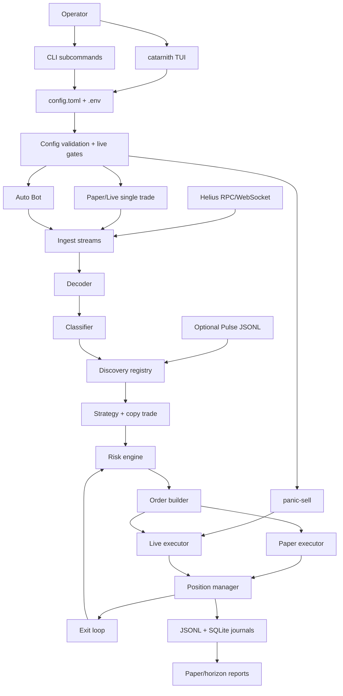
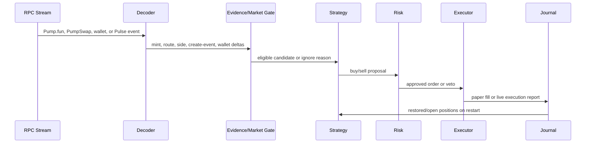

# Catarnith Documentation

Catarnith is a terminal-first Solana Pump.fun trading app. It combines a TUI,
paper trading, guarded live execution, an autonomous scanner, copy trade, and
panic-sell tooling around one local runtime profile: `config.toml`.

Catarnith does not create or launch tokens. It only observes existing Pump.fun
markets, filters candidates, applies risk rules, and either simulates orders in
paper mode or broadcasts live transactions after explicit live gates pass.

## Project Description

| Area | What It Does |
| --- | --- |
| `catarnith` | Main terminal app with mode picker, Settings, paper trade, live trade, Auto Bot launcher, logs, and panic-sell UI. |
| `bot` | Autonomous scanner/trader loop. Used directly or through `[1] Auto Bot` in the TUI. |
| `live_execute` | One-shot live buy/sell helper used by panic-sell and advanced CLI workflows. |
| `config.toml` | Single local runtime profile for paper, live, and Auto Bot. |
| `.env` | Local secrets and machine-specific overrides. |
| `journals/` | JSONL journals, SQLite position state, reports, and runtime evidence. |

Paper mode is the default safe path. Live mode is available, but it requires a
dedicated wallet, live arming flags, risk caps, and wallet/RPC safety checks.

## Architecture



## Trading Flow



## Runtime Modes

Running `catarnith` opens the mode picker:

```text
[1] Auto Bot      autonomous scanner/trader loop
[2] Live Trade    single live trade flow
[3] Paper Trade   paper trading, no real orders
[S] Settings      wallet, keys, market, buy size, live setup
```

The picker is the source of truth for single-trade mode. Choosing Paper forces
paper-only execution for that run. Choosing Live forces live validation and then
uses the live executor only if live gates are armed.

## TUI Usage

### Global Keys

| Key | Action |
| --- | --- |
| `1`, `2`, `3`, `S` | Pick Auto Bot, Live Trade, Paper Trade, or Settings from the mode picker. |
| `Enter` | Start, confirm, sell when prompted, or save the active setup screen. |
| `Esc` | Back/cancel. In bot/live screens, closes the log overlay first when it is open. |
| `Q` | Quit from non-text-entry screens. |
| `T` | Cycle terminal theme. |
| `L` | Open or close the larger log overlay. |
| `Up` / `Down` | Scroll normal logs outside settings screens. |
| `PgUp` / `PgDn` | Scroll logs faster. |
| `Home` / `End` | Jump to oldest log line or return to tail. |
| `Tab` / `Shift+Tab` | Move between fields in Settings and Auto Bot Setup. |
| `Left` / `Right` | Toggle/cycle selected choices such as market, theme, live gates, copy sizing, or copy policy. |

### Settings

Settings is for operator-level setup:

- wallet secret or wallet keypair path
- Helius API key
- optional fallback RPC
- optional Jupiter API key
- market preference: `mayhem_only`, `non_mayhem_only`, or `all_pumpfun`
- buy size, buy slippage, and theme
- advanced live controls: live enable, live lock, max wallet balance, max hold,
  sell slippage, priority fee, Jito URL/tip, confirmation polling, and
  pre-broadcast simulation

Settings does not contain a paper/live mode picker. Paper vs Live is selected
from the main mode picker.

### Auto Bot Setup

Auto Bot Setup appears before `[1] Auto Bot` starts. It owns bot-specific
configuration:

- direct bot mode default: paper or live
- market preference
- buy size, slippage, max hold, stream age, and buy deadline
- copy trade wallet, sizing, max buy, and follow-sells toggle
- advanced bot controls: keep-alive, max positions, max buys per mint,
  per-mint exposure, total open exposure, daily loss, copy buy policy,
  copy-specific caps, create slot lag, backfill, full transaction fetch, curve
  exit quotes, confirmation polling, and fallback reads

When `bot_keep_alive = true`, the TUI restarts the bot child process if it exits
unexpectedly. Rapid repeated startup failures are stopped and surfaced in logs.

### Trade Screens

Paper Trade and Live Trade use the same visual lifecycle:

```text
Welcome -> Scanning -> Evaluating -> Holding -> Selling -> Result
```

| Screen | What Happens |
| --- | --- |
| Welcome | Press `Enter` to start scanning. |
| Scanning | Catarnith listens for fresh candidate events. |
| Evaluating | Candidate is checked against market, discovery, strategy, and risk rules. |
| Holding | Press `Enter` to sell the held position. |
| Selling | Wait for paper fill or live sell result. |
| Result | Press `Enter` to trade again or `Esc` to return to the picker. |

If a position is open and you press `Esc`, Catarnith asks for confirmation
before leaving the trade screen.

In live mode, `submitted` means the sell transaction was broadcast but not yet
confirmed. Catarnith keeps showing the position as held until confirmation or
reconciliation proves the inventory is gone.

### Logs

Press `L` to open the larger log overlay. Logs are scrollable with `PgUp`,
`PgDn`, `Home`, and `End`. Expected lifecycle noise is cleaned up, while real
execution, transport, panic-sell, and fatal bot errors remain visible.

## Setup

### Requirements

- Rust stable toolchain
- Helius API key
- For live trading: a dedicated low-balance hot wallet
- Optional live reliability: distinct paid fallback RPC
- Optional last-resort sell fallback: authenticated Jupiter API key

### Install From Source

```bash
git clone https://github.com/jxstme22/catarnith.git
cd catarnith
cargo install --path . --locked
catarnith
```

For development without installing:

```bash
cargo run --bin catarnith
```

### Create Local Files

```bash
cp config.example.toml config.toml
cp .env.example .env
```

Both files are gitignored. Never commit wallet keys, RPC keys, or `.env`.

### Minimum Local Values

In `.env`:

```bash
export HELIUS_API_KEY=your-helius-api-key
```

In `config.toml`, keep the safe defaults until paper behavior looks healthy:

```toml
mode = "paper"
market = "mayhem_only"
enable_live_trading = false
require_manual_live_unlock = true
```

## Important Config Keys

| Key | Meaning |
| --- | --- |
| `mode` | Default for direct `bot`/`scan` runs. The TUI picker overrides single-trade mode. |
| `helius_api_key` | Helius API key, usually provided by `HELIUS_API_KEY`. |
| `wallet_keypair_path` | Dedicated live hot-wallet JSON path. |
| `wallet_keypair_base58` | Optional base58 secret. Prefer `.env` over TOML for secrets. |
| `market` | `mayhem_only`, `non_mayhem_only`, or `all_pumpfun`. Legacy `pair_scope` still loads. This gates normal entries and copy-trade buys. |
| `target_wallet` | Optional reference wallet. Leave unset unless intentionally using one. |
| `watched_wallets` | Optional additional wallets to watch. |
| `base_buy_sol` | Base buy size in SOL. Legacy `base_buy_lamports` still loads. |
| `max_slippage_bps` | Buy slippage ceiling in basis points. |
| `max_hold_seconds` | Forced exit timer. |
| `max_open_positions` | Concurrent open position cap. |
| `max_buys_per_mint` | Total buy-attempt cap per mint. |
| `max_total_sol_per_mint` | Per-mint exposure cap in SOL. |
| `max_total_open_sol` | Total open exposure cap in SOL. |
| `max_daily_loss_sol` | Daily loss stop for new entries in SOL. |
| `backfill_limit` | Startup history depth. Keep `0` for live. |
| `journal_dir` | JSONL journal directory. |
| `sqlite_path` | SQLite position state path. |

### Market Selection

- `mayhem_only`: enter only when Mayhem evidence is allowed/verified. The
  single-trade scanner waits for a positive Pump.fun curve Mayhem flag.
- `non_mayhem_only`: fresh Pump.fun create/create-v2 entries only. It rejects
  direct Mayhem evidence, indirect Mayhem candidates, and copied Mayhem buys.
  The single-trade scanner requires `is_mayhem_mode = false` from the curve; if
  the flag is unavailable, the candidate is skipped instead of guessed.
- `all_pumpfun`: allow both Mayhem and non-Mayhem Pump.fun candidates that pass
  the rest of the filters.

## Copy Trade

Copy trade is part of Auto Bot. It follows a configured source wallet but still
uses Catarnith's strategy, risk engine, executors, journals, and position
manager.

| Key | Meaning |
| --- | --- |
| `copy_trade_enabled` | Enables copy trade. |
| `copy_trade_wallet` | Source wallet to follow. |
| `copy_trade_sizing` | `fixed`, `mirror`, or `scaled`. |
| `copy_trade_scale_bps` | Scale factor for `scaled`; `10000` is 1.0x. |
| `copy_trade_max_buy_sol` | Hard cap for copied buy size in SOL. |
| `copy_trade_buy_policy` | `first_only` or `accumulate`. |
| `copy_trade_max_buys_per_mint` | Copy-specific buy limit per mint. |
| `copy_trade_min_source_buy_sol` | Ignore source buys below this size; `0` disables the filter. |
| `copy_trade_follow_sells` | Sell when the source wallet sells a mint Catarnith holds. |
| `copy_trade_max_hold_seconds` | Forced exit timer for copy-entered positions. |
| `copy_trade_take_profit_bps` | Copy-specific take-profit trigger; `0` disables it. |
| `copy_trade_take_profit_sell_bps` | Portion sold on copy take-profit. |
| `copy_trade_stop_loss_bps` | Copy-specific stop-loss trigger; `0` disables it. |
| `copy_trade_allow_pumpswap` | Paper/research only. Live PumpSwap copy execution is blocked. |

Copy attribution is strict: a copied transaction must come from the copied
wallet stream or have that wallet as signer. Transactions that only mention the
wallet as an account key are ignored.

Copy-trade buys obey `market`. `non_mayhem_only` rejects direct, indirect, or
verified Mayhem signals; `mayhem_only` requires Mayhem evidence; `all_pumpfun`
allows either side of the Pump.fun market.

## Live Configuration

Live-only execution tuning lives in `[live]`.

| `[live]` Key | Env Override | Meaning |
| --- | --- | --- |
| `compute_unit_limit` | `CTARNITH_LIVE_COMPUTE_UNIT_LIMIT` | Compute units per trade transaction. |
| `compute_unit_price_microlamports` | `CTARNITH_LIVE_COMPUTE_UNIT_PRICE_MICROLAMPORTS` | Priority fee. |
| `send_max_retries` | `CTARNITH_LIVE_SEND_MAX_RETRIES` | RPC send retries. |
| `send_timeout_ms` | `CTARNITH_LIVE_SEND_TIMEOUT_MS` | Per-RPC send timeout. |
| `rpc_timeout_ms` | `CTARNITH_LIVE_RPC_TIMEOUT_MS` | General RPC timeout. |
| `confirmation_timeout_ms` | `CTARNITH_LIVE_CONFIRMATION_TIMEOUT_MS` | Buy confirmation timeout. |
| `sell_confirmation_timeout_ms` | `CTARNITH_LIVE_SELL_CONFIRMATION_TIMEOUT_MS` | Sell confirmation timeout. |
| `confirmation_poll_ms` | `CTARNITH_LIVE_CONFIRMATION_POLL_MS` | Confirmation polling interval. |
| `pre_broadcast_simulation` | `CTARNITH_LIVE_PRE_BROADCAST_SIMULATION` | Simulate before broadcast. |
| `settlement_commitment` | `CTARNITH_LIVE_SETTLEMENT_COMMITMENT` | `processed`, `confirmed`, or `finalized`. |
| `sell_slippage_bps` | `CTARNITH_LIVE_SELL_SLIPPAGE_BPS` | Sell slippage. |
| `max_balance_sol` | `CTARNITH_LIVE_MAX_BALANCE_SOL` | Refuse to trade above this wallet balance. |
| `jito_block_engine_url` | `CTARNITH_LIVE_JITO_BLOCK_ENGINE_URL` | Optional Jito broadcast path. |
| `jito_tip_account` | `CTARNITH_LIVE_JITO_TIP_ACCOUNT` | Optional Jito tip account. |
| `jito_tip_sol` | `CTARNITH_LIVE_JITO_TIP_SOL` | Jito tip amount in SOL. Legacy lamport keys still load. |
| `jupiter_timeout_ms` | `CTARNITH_LIVE_JUPITER_TIMEOUT_MS` | Jupiter sell fallback timeout. |

## Important Environment Variables

Use `CTARNITH_*` names for new setup. Legacy `MAYHEM_*` names are read as
fallbacks for old local scripts.

| Variable | Meaning |
| --- | --- |
| `HELIUS_API_KEY` | Primary Helius API key. |
| `HELIUS_API_KEY_FILE` | Optional file containing the Helius key. |
| `CTARNITH_LIVE_CONFIG` | Active config path. Defaults to `config.toml`. |
| `CTARNITH_FALLBACK_RPC_URL` | Optional distinct paid fallback RPC. |
| `JUP_API_KEY` | Optional authenticated Jupiter API key for last-resort sell fallback. |
| `CTARNITH_WALLET_KEYPAIR_PATH` | Live wallet keypair JSON path. |
| `CTARNITH_WALLET_KEYPAIR_BASE58` | Live wallet base58 secret. Wins over keypair path. |
| `CTARNITH_MARKET` | Overrides `market`. |
| `CTARNITH_LIVE_BASE_BUY_SOL` | Overrides buy size. |
| `CTARNITH_LIVE_MAX_SLIPPAGE_BPS` | Overrides buy slippage. |
| `CTARNITH_LIVE_MAX_HOLD_SECONDS` | Overrides max hold. |
| `CTARNITH_LIVE_ENABLE_LIVE_TRADING` | Overrides live enable gate. |
| `CTARNITH_LIVE_REQUIRE_MANUAL_LIVE_UNLOCK` | Overrides manual live lock. |
| `CTARNITH_LIVE_PARALLEL_FALLBACK_READS` | Enables parallel primary/fallback reads. |
| `CTARNITH_LIVE_WAIT_FOR_BUY_CONFIRMATION` | Waits for buy confirmation when true. |
| `CTARNITH_LIVE_SKIP_POST_TRADE_BALANCES` | Skips post-trade balance reads when true. |
| `CTARNITH_SCAN_SOL_PRICE_USD` | Pins SOL/USD in the scan TUI. |
| `CTARNITH_SCAN_SKIP_PICKER` | Skips the mode picker and enters scan mode. |
| `CTARNITH_LIVE_PANIC_SEND_TIMEOUT_MS` | Panic-sell send timeout. |
| `CTARNITH_LIVE_PANIC_BALANCE_TIMEOUT_MS` | Panic-sell balance-read timeout. |

## How To Run

Installed commands:

```bash
catarnith
catarnith --config config.toml scan
catarnith bot --config config.toml
catarnith panic-sell <MINT> --config config.toml
live_execute --config config.toml --side sell --mint <MINT>
```

Development equivalents:

```bash
cargo run --bin catarnith
cargo run --bin catarnith -- --config config.toml scan
cargo run --bin bot -- --config config.toml
cargo run --bin live_execute -- --config config.toml --side sell --mint <MINT>
```

Build all release binaries:

```bash
cargo build --release --locked --bins
```

Install all binaries onto your PATH:

```bash
cargo install --path . --locked
```

## Live Mode Checklist

Before live broadcast:

1. Validate behavior in paper mode first.
2. Select `[2] Live Trade` in the picker, or set `mode = "live"` for direct runs.
3. Set `enable_live_trading = true`.
4. Set `require_manual_live_unlock = false`.
5. Configure a dedicated hot wallet with low balance.
6. Keep wallet files outside the repo and owner-only (`chmod 600`).
7. Keep `[live].max_balance_sol` low.
8. Keep live `backfill_limit = 0`.
9. If `CTARNITH_FALLBACK_RPC_URL` is set, make it distinct from the primary RPC.
10. Re-run tests after code or config changes.

## Runtime Output

Runtime output defaults to `journals/bot/` for the example config. Important
files include:

| File | Meaning |
| --- | --- |
| `raw_events.jsonl` | Streamed raw events. |
| `decoded_transactions.jsonl` | Decoded transaction facts. |
| `discovery_signals.jsonl` | Discovery evidence. |
| `decisions.jsonl` | Strategy decisions and ignore/veto reasons. |
| `orders.jsonl` | Orders created from approved decisions. |
| `executions.jsonl` | Paper or live execution reports. |
| `positions.jsonl` | Position snapshots. |
| `metrics_snapshots.jsonl` | Runtime heartbeat metrics. |
| SQLite file | Position restore state across restarts. |

These files are intentionally gitignored. They are safe to clear for old paper
or test runs, but keep them when you need live-trade evidence, sell/retry
debugging, or open-position recovery after a restart.

## Verification

Recommended checks:

```bash
cargo fmt
cargo test
cargo clippy --all-targets -- -D warnings
git diff --check
```

## Troubleshooting

| Symptom | What To Check |
| --- | --- |
| Settings opens immediately | Local setup is missing or incomplete. Save Settings once. |
| Config will not load | Check TOML syntax and the active config path shown in the picker. |
| Missing Helius key | Set `HELIUS_API_KEY`, `HELIUS_API_KEY_FILE`, or `helius_api_key`. |
| Live refuses to start | Check live gates, wallet source, max balance, risk caps, and optional fallback RPC. |
| No candidates appear | Check RPC/WebSocket access, stream fallback, market selection, and evidence gates. |
| Copy trade does not buy | Check `copy_trade_enabled`, source wallet, full transaction fetch, source buy size, max buys per mint, and whether the copied mint is blocked by `market`. |
| Non-Mayhem enters Mayhem or old tokens | It should not. `non_mayhem_only` requires a fresh create/create-v2 event and explicit curve `is_mayhem_mode = false`; unknown flags and Mayhem signals are skipped. |
| Logs are hard to inspect | Press `L`, then use `PgUp`, `PgDn`, `Home`, and `End`. |

Nothing here is financial advice. Treat live mode as real-money software and
test with tiny balances only after paper validation.
