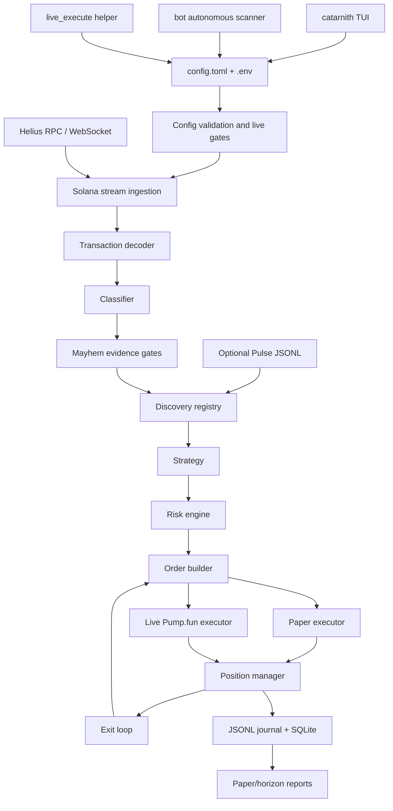
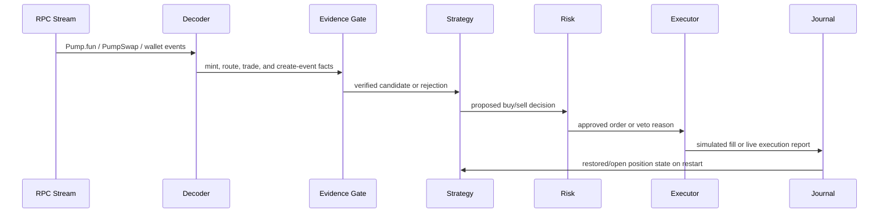

# Catarnith Documentation

Catarnith is a terminal-first Solana trading app for Pump.fun-style markets. It
combines an interactive TUI, a paper-first autonomous scanner, and a gated live
execution path behind one local configuration file: `config.toml`.

Catarnith does not create or launch tokens. It observes on-chain activity,
filters fresh mint candidates, evaluates risk, and either simulates trades in
paper mode or sends real Pump.fun transactions only after live mode is
explicitly armed.

## Project Summary

Catarnith is built for operators who want fast feedback, strong guardrails, and
repeatable local configuration.

| Area | Description |
| --- | --- |
| Main terminal | `catarnith` opens a mode picker, settings editor, paper trade screen, live trade screen, and panic-sell flow. |
| Autonomous bot | `bot` runs the multi-mint scanner/trader loop using `config.toml`. |
| Live helper | `live_execute` performs one-shot buy/sell execution and powers panic-sell paths. |
| Default safety | Paper mode is the default. Live trading is locked unless multiple config and wallet checks pass. |
| Output | Runtime journals and SQLite state are written under `journals/` by default. |

## Runtime Modes

```text
[1] Auto Bot     autonomous scanner/trader loop
[2] Live Trade   single live trade flow with real SOL, if armed
[3] Paper Trade  simulated trading, no real orders
[S] Settings     wallet, keys, buy size, risk, and runtime knobs
```

Selecting Live in the TUI does not bypass live-safety checks. The config must
still be deliberately armed.

## Using The TUI

Run the installed binary with:

```bash
catarnith
```

If you built locally without installing:

```bash
./target/release/catarnith
```

The bottom footer always shows the valid keys for the current screen.

### First Run

When Catarnith cannot find `config.toml` or `.env`, it opens Settings first.
Fill the required fields, press `Enter` to save, then return to the mode picker.
Saving writes `config.toml` and matching keys in `.env`.

### Global Keys

| Key | Action |
| --- | --- |
| `T` | Cycle terminal theme. |
| `L` | Toggle the log panel. |
| `Q` | Quit from non-settings screens. |
| `Ctrl-C` | Quit from any screen. |
| `Esc` | Back, cancel, or return to menu depending on screen. |

Global letter shortcuts are disabled while typing in Settings so values such as
wallet keys and RPC URLs can be entered normally.

### Mode Picker

| Key | Action |
| --- | --- |
| `1` | Open Auto Bot setup. |
| `2` | Enter Live Trade mode. |
| `3` | Enter Paper Trade mode. |
| `S` | Open Settings. |
| `T` | Cycle theme. |
| `Q` | Quit. |

The picker also shows the active config path, normally `config.toml`.

### Settings

Settings is the main operator editor. It covers wallet, keys, trading size, and
risk controls.

| Key | Action |
| --- | --- |
| `Tab` / `Down` | Move to next field. |
| `Shift-Tab` / `Up` | Move to previous field. |
| `Left` / `Right` | Change choices such as theme, mode, pair scope, or advanced toggle. |
| Type text | Edit the active text field. |
| `Backspace` | Delete one character from the active text field. |
| `Enter` | Save settings. |
| `Esc` | Return to the mode picker without starting a trade. |

Editable fields include:

- Wallet private key/base58 input
- Buy size in SOL
- Helius API key
- Fallback RPC URL
- Jupiter API key
- Slippage in bps
- Max hold seconds
- Theme
- Mode: Paper or Live
- Pair scope: Mayhem-only or all Pump.fun
- Advanced risk: take-profit, stop-loss, max open positions, daily loss limit

Saving Settings does not automatically arm live trading. Live still needs the
explicit live-mode checklist later in this document.

### Auto Bot Setup

Press `1` from the mode picker to configure the autonomous scanner before it
starts. The controls are the same as Settings, except `Enter` saves and starts
the bot.

Auto Bot setup includes:

- Mode
- Pair scope
- Buy size
- Slippage
- Max hold
- Stream age limit
- Buy deadline
- Advanced options: create slot lag, backfill, full transaction fetch, curve
  exit quotes, confirmation polling, fallback read behavior

While the bot is running:

| Key | Action |
| --- | --- |
| `Esc` | Stop the bot. |
| `Q` | Quit. |
| `L` | Toggle logs. |

After the bot stops, press `Esc` again to return to the menu.

### Paper Trade And Live Trade Screens

Paper and Live Trade share the same visual flow:

```text
Welcome -> Scanning -> Evaluating -> Holding -> Selling -> Result
```

| Screen | Main Action |
| --- | --- |
| Welcome | Press any key to start scanning. |
| Scanning | Catarnith listens for fresh candidate events. |
| Evaluating | Candidate is being checked against evidence, strategy, and risk. |
| Holding | Press `Enter` to sell the held position. |
| Selling | Wait for paper fill or live sell result. |
| Result | Press `Enter` to trade again or `Esc` to return to menu. |

If a position is open and you press `Esc`, Catarnith asks for confirmation. If
you leave, the position stays open; it is not auto-sold just because you left
the screen.

### Logs

Press `L` on non-settings screens to show or hide the log panel. The newest
messages stay near the bottom. Execution, sell, panic, and error-related lines
are highlighted so operational issues are easier to spot.

### Panic Sell

For direct panic-sell from the shell:

```bash
catarnith panic-sell <MINT> --config config.toml
```

The command forwards to the live execution helper with the panic path enabled.
It still uses the configured wallet, RPC, slippage, and live safety settings.

## Architecture



## Trading Flow



## Safety Model

Paper mode never submits orders. It only records simulated fills and PnL in
local journals.

Live mode refuses to broadcast unless:

- `mode = "live"`
- `enable_live_trading = true`
- `require_manual_live_unlock = false`
- a dedicated hot-wallet key is configured
- wallet files are outside the repository and owner-only
- the wallet path does not look like a main/cold/treasury wallet
- the fallback RPC is a distinct paid provider when required
- risk caps are present and large enough for the configured buy size
- `[live].max_balance_lamports` caps the maximum wallet balance Catarnith may
  trade with

This project is automation for a risky market. Treat live mode as real-money
software and validate changes in paper mode first.

## Setup

### 1. Requirements

- Rust stable toolchain
- Helius API key
- Optional but recommended for live mode: distinct paid Solana RPC
- Optional sell fallback: authenticated Jupiter API key
- For live mode only: dedicated low-balance hot wallet

### 2. Create Local Config Files

```bash
cp config.example.toml config.toml
cp .env.example .env
```

Both `config.toml` and `.env` are ignored by git.

### 3. Fill Required Values

In `.env`:

```bash
export HELIUS_API_KEY=your-helius-api-key
export CTARNITH_FALLBACK_RPC_URL=https://your-paid-rpc.example
```

In `config.toml`, start with:

```toml
mode = "paper"
base_buy_lamports = 13025001
enable_live_trading = false
require_manual_live_unlock = true
```

Keep paper mode until the journals show behavior you trust.

### 4. Build

```bash
cargo build --release --locked --features live-executor,tui --bins
```

Use `--locked` so Cargo uses the dependency versions pinned in `Cargo.lock`.

## Configuration Reference

Catarnith loads config in this order:

1. Built-in defaults
2. Selected TOML file, normally `config.toml`
3. `.env` and exported environment overrides

New setup should use `CTARNITH_*` environment variables. Legacy `MAYHEM_*`
aliases are still accepted as fallbacks.

### Core Config Keys

| Key | Short Description |
| --- | --- |
| `mode` | `"paper"` or `"live"`. Paper is the default safe mode. |
| `helius_api_key` | Helius API key. Usually set as `HELIUS_API_KEY` in `.env`. |
| `wallet_keypair_path` | Path to a dedicated live hot-wallet JSON keypair. |
| `wallet_keypair_base58` | Optional base58 private key value. Prefer `.env` for secrets. |
| `pair_scope` | `"mayhem_only"` for strict filtering or `"all_pumpfun"` for broader observation. |
| `base_buy_lamports` | Buy size in lamports. `1 SOL = 1_000_000_000` lamports. |
| `journal_dir` | Directory for JSONL runtime journals. |
| `sqlite_path` | SQLite state path used for position restore. |

### Discovery and Evidence Keys

| Key | Short Description |
| --- | --- |
| `require_mayhem_evidence` | Requires trusted Mayhem evidence before entry. |
| `allow_indirect_mayhem_candidates` | Allows weaker indirect candidates when enabled. |
| `require_route_confirmation` | Requires observed route confirmation such as Axiom -> Pump.fun/PumpSwap. |
| `follow_observed_sell_signals` | Allows observed sell activity to influence exits. |
| `mayhem_mint_allowlist_path` | Optional newline-delimited verified mint allowlist. |
| `mayhem_metadata_url_template` | Optional trusted metadata endpoint template. |
| `pulse_mints_path` | Optional JSONL discovery feed tailed at runtime. |
| `allow_onchain_mayhem_discovery` | Allows on-chain Mayhem evidence to verify discoveries. |
| `require_fresh_mint_creation` | Requires create-backed fresh mint evidence. Recommended for live speed mode. |
| `max_stream_event_age_ms` | Rejects stale stream events. |
| `entry_deadline_ms` | Maximum local age before a buy is considered too late. |
| `max_create_event_slot_lag` | Rejects create events too far behind the current processed slot. |

### Risk and Exit Keys

| Key | Short Description |
| --- | --- |
| `max_open_positions` | Maximum concurrent positions. |
| `max_buys_per_mint` | Maximum buys allowed for one mint. |
| `max_total_lamports_per_mint` | Per-mint exposure cap. |
| `max_total_open_lamports` | Total open exposure cap. |
| `max_daily_loss_lamports` | Rolling loss cap before new buys are vetoed. |
| `max_failed_txs_per_minute` | Failure-rate safety cap. |
| `max_failed_fee_burn_lamports_per_hour` | Fee-burn safety cap. |
| `max_slippage_bps` | Buy slippage ceiling in basis points. |
| `paper_slippage_bps` | Adverse paper-fill slippage model. |
| `paper_fee_lamports_floor` | Minimum paper fee applied to simulated fills. |
| `take_profit_bps` | Take-profit trigger. |
| `take_profit_sell_bps` | Portion to sell after take-profit, in basis points. |
| `stop_loss_bps` | Stop-loss trigger. |
| `max_hold_seconds` | Forced exit timer. |
| `enable_take_profit_exit` | Enables take-profit exit checks. |
| `enable_stop_loss_exit` | Enables stop-loss exit checks. |
| `enable_curve_exit_quotes` | Uses curve quotes for exit valuation. |

### Runtime Stream Keys

| Key | Short Description |
| --- | --- |
| `subscribe_commitment` | Stream commitment, usually `"processed"`. |
| `subscribe_programs` | Subscribes to configured program logs. |
| `enable_transaction_subscribe` | Enables transactionSubscribe when the RPC plan supports it. |
| `enable_logs_fallback` | Falls back to logsSubscribe when transactionSubscribe is unavailable. |
| `fetch_full_transaction` | Fetches full transactions for richer decoding. |
| `use_observed_entry_fill` | Paper-only model that prices entries from observed signal transactions. |
| `backfill_limit` | Startup backfill depth. Keep `0` for live mode. |

### Live Execution Keys

The `[live]` table tunes real transaction sending.

| `[live]` Key | Env Override | Short Description |
| --- | --- | --- |
| `compute_unit_limit` | `CTARNITH_LIVE_COMPUTE_UNIT_LIMIT` | Compute units per trade transaction. |
| `compute_unit_price_microlamports` | `CTARNITH_LIVE_COMPUTE_UNIT_PRICE_MICROLAMPORTS` | Priority fee. |
| `send_max_retries` | `CTARNITH_LIVE_SEND_MAX_RETRIES` | RPC send retries. |
| `send_timeout_ms` | `CTARNITH_LIVE_SEND_TIMEOUT_MS` | Per-RPC send timeout. |
| `rpc_timeout_ms` | `CTARNITH_LIVE_RPC_TIMEOUT_MS` | General RPC timeout. |
| `confirmation_timeout_ms` | `CTARNITH_LIVE_CONFIRMATION_TIMEOUT_MS` | Buy confirmation timeout. |
| `sell_confirmation_timeout_ms` | `CTARNITH_LIVE_SELL_CONFIRMATION_TIMEOUT_MS` | Sell confirmation timeout. |
| `confirmation_poll_ms` | `CTARNITH_LIVE_CONFIRMATION_POLL_MS` | Confirmation polling interval. |
| `pre_broadcast_simulation` | `CTARNITH_LIVE_PRE_BROADCAST_SIMULATION` | Simulates before broadcast when enabled. |
| `settlement_commitment` | `CTARNITH_LIVE_SETTLEMENT_COMMITMENT` | `processed`, `confirmed`, or `finalized`. |
| `sell_slippage_bps` | `CTARNITH_LIVE_SELL_SLIPPAGE_BPS` | Sell slippage; omit to reuse `max_slippage_bps`. |
| `max_balance_lamports` | `CTARNITH_LIVE_MAX_BALANCE_LAMPORTS` | Refuses to trade above this wallet balance. |
| `jito_block_engine_url` | `CTARNITH_LIVE_JITO_BLOCK_ENGINE_URL` | Optional Jito panic-sell path. |
| `jito_tip_account` | `CTARNITH_LIVE_JITO_TIP_ACCOUNT` | Jito tip account. |
| `jito_tip_lamports` | `CTARNITH_LIVE_JITO_TIP_LAMPORTS` | Jito tip amount. |
| `jupiter_timeout_ms` | `CTARNITH_LIVE_JUPITER_TIMEOUT_MS` | Timeout for Jupiter sell fallback. |

## Important Environment Variables

| Variable | Description |
| --- | --- |
| `HELIUS_API_KEY` | Primary Helius API key. Used to derive the main RPC/WebSocket URLs. |
| `HELIUS_API_KEY_FILE` | Optional path to a file containing the Helius API key. |
| `CTARNITH_LIVE_CONFIG` | Overrides the active config path. Defaults to `config.toml`. |
| `CTARNITH_FALLBACK_RPC_URL` | Distinct paid Solana RPC used by live broadcast/fallback paths. |
| `JUP_API_KEY` | Optional Jupiter API key for last-resort sell fallback. |
| `CTARNITH_WALLET_KEYPAIR_PATH` | Live hot-wallet keypair file path. |
| `CTARNITH_WALLET_KEYPAIR_BASE58` | Live hot-wallet base58 private key. Wins over keypair path. |
| `CTARNITH_LIVE_BASE_BUY_LAMPORTS` | Env override for buy size. |
| `CTARNITH_LIVE_MAX_SLIPPAGE_BPS` | Env override for buy slippage. |
| `CTARNITH_PAIR_SCOPE` | Env override for `pair_scope`. |
| `CTARNITH_LIVE_SELL_SLIPPAGE_BPS` | Sell-specific slippage override. |
| `CTARNITH_LIVE_MAX_HOLD_SECONDS` | Env override for forced exit timer. |
| `CTARNITH_LIVE_PARALLEL_FALLBACK_READS` | Reads from primary and fallback RPCs in parallel when set. |
| `CTARNITH_LIVE_WAIT_FOR_BUY_CONFIRMATION` | Waits for buy confirmation before continuing when true. |
| `CTARNITH_LIVE_SKIP_POST_TRADE_BALANCES` | Skips post-trade balance reads when true. |
| `CTARNITH_SCAN_SOL_PRICE_USD` | Pins SOL/USD in the scan UI and skips the startup price fetch. |
| `CTARNITH_SCAN_SKIP_PICKER` | Skips the mode picker and enters scan mode. |
| `CTARNITH_LIVE_PANIC_SEND_TIMEOUT_MS` | Panic-sell send timeout. |
| `CTARNITH_LIVE_PANIC_BALANCE_TIMEOUT_MS` | Panic-sell balance-read timeout. |

## How To Run

### Interactive Terminal

```bash
cargo run --features live-executor,tui --bin catarnith
```

### Skip Picker And Enter Trade Screen

```bash
cargo run --features live-executor,tui --bin catarnith -- scan
```

### Autonomous Bot

```bash
cargo run --features live-executor --bin bot -- --config config.toml
```

### One-Shot Live Execute

```bash
cargo run --features live-executor --bin live_execute -- \
  --config config.toml --side sell --mint <MINT>
```

### Panic Sell Through Catarnith

```bash
cargo run --features live-executor,tui --bin catarnith -- \
  panic-sell <MINT> --config config.toml
```

### Build Release Binaries

```bash
cargo build --release --locked --features live-executor,tui --bins
```

Then run:

```bash
./target/release/catarnith
./target/release/bot --config config.toml
./target/release/live_execute --config config.toml --side sell --mint <MINT>
```

### Test

```bash
cargo test --features "live-executor tui"
```

## Live Mode Checklist

Before live mode:

1. Keep paper mode running long enough to understand journal behavior.
2. Set `mode = "live"`.
3. Set `enable_live_trading = true`.
4. Set `require_manual_live_unlock = false`.
5. Use a dedicated hot wallet, not a main or treasury wallet.
6. Store wallet files outside the repository and run `chmod 600 <wallet-file>`.
7. Set `CTARNITH_FALLBACK_RPC_URL` to a distinct paid RPC.
8. Keep `[live].max_balance_lamports` low.
9. Keep `backfill_limit = 0`.
10. Re-run tests after config or code changes.

## Runtime Output

By default, Catarnith writes local runtime output under:

```text
journals/bot/
```

Important files include:

| File | Description |
| --- | --- |
| `raw_events.jsonl` | Streamed raw events. |
| `decisions.jsonl` | Strategy decisions and risk vetoes. |
| `orders.jsonl` | Orders created from approved decisions. |
| `executions.jsonl` | Paper or live execution reports. |
| `positions.jsonl` | Position snapshots. |
| `metrics_snapshots.jsonl` | Runtime heartbeat metrics. |
| SQLite file | Position restore state across restarts. |

## Troubleshooting

| Symptom | What To Check |
| --- | --- |
| Config will not load | Confirm `config.toml` exists and parses as TOML. |
| Missing Helius key | Set `HELIUS_API_KEY`, `HELIUS_API_KEY_FILE`, or `helius_api_key`. |
| Live mode refuses to start | Check live arming flags, wallet path, fallback RPC, and risk caps. |
| No candidates appear | Check RPC/WebSocket access, stream fallback, and evidence gates. |
| Decisions are rejected | Inspect `decisions.jsonl` for `risk_veto_reason`. |
| Orders are created but no fills | Inspect `executions.jsonl`, slippage, RPC errors, and wallet balance. |
| Wallet balance blocked | Lower wallet balance or raise `[live].max_balance_lamports` deliberately. |
